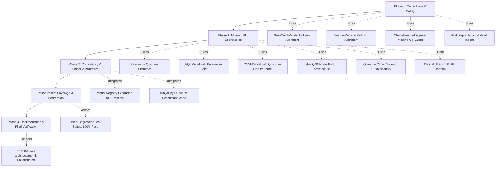

# Comprehensive Codebase & Architecture Audit: Hybrid Quantum-Classical CVD Prediction Platform

**Audit Date**: September 2026  
**Auditor**: Antigravity Automated Verification Agent  
**Scope**: Full repository inspection of `src/`, `tests/`, `run_all.py`, `run_tests.py`, configuration files, datasets, and SIH Problem Statement 3 Deliverable Compliance.

---

## Executive Summary

A comprehensive, end-to-end audit was conducted across every source file, test suite, and configuration in the repository. The codebase features a mature, leakage-safe classical machine learning pipeline for cardiovascular disease (CVD) risk prediction spanning 8 models, IQR clipping, nested hyperparameter tuning, external validation against the Framingham Heart Study, and clinical explainability.

However, the repository currently exhibits critical correctness/safety vulnerabilities in feature alignment and transformer guards, and—most significantly—presents a major **deliverables gap** against the target **Smart India Hackathon (SIH) Problem Statement 3 ("Hybrid Quantum-Classical Disease-Prediction Platform")**:
1. **Quantum Machine Learning Models (VQC, QSVM, Hybrid QNN) are entirely absent** from the repository.
2. **Quantum Explainability (circuit sensitivity, gate saliency, parameter shift attribution) is absent**.
3. **Software Platform UI / REST API for clinicians is absent**.
4. **Subtle correctness bugs** in `BaseCardioModel._prepare_input` and `FeatureReducer.transform` silently risk feature column scrambling under DataFrame re-ordering.
5. `ClinicalFeatureEngineer.transform` fails loudly when evaluating external cohorts that legitimately lack optional features.

Below is the exhaustive module-by-module audit and phased remediation roadmap.

---

## 1. Correctness & Safety Audit (Phase 0)

### 1.1 Silent Column Scrambling in `BaseCardioModel._prepare_input` (`src/models/base.py:L37-L49`)
* **Finding**: In `BaseCardioModel._prepare_input()`, when an input DataFrame is passed post-fitting:
  ```python
  if isinstance(X, pd.DataFrame):
      if not self.is_fitted_:
          self.feature_names_in_ = list(X.columns)
      return X.to_numpy(dtype=np.float64)
  ```
  If `X` is passed with permuted column order or extra columns, `X.to_numpy()` strips column names blindly according to the DataFrame's current physical layout. The model evaluates weights against incorrect features without raising an error or warning.
* **Risk**: Silent mathematical corruption of predictions, probabilities, and evaluation metrics whenever a DataFrame's column ordering deviates from training fold ordering.
* **Remediation**: Align DataFrame columns strictly: `X[self.feature_names_in_].to_numpy(dtype=np.float64)`. Raise a descriptive `ValueError` if required columns in `self.feature_names_in_` are missing.

### 1.2 Unaligned Feature Transformation in `FeatureReducer.transform` (`src/reduction.py:L157-L167`)
* **Finding**: In `FeatureReducer.transform()`:
  ```python
  if isinstance(X, pd.DataFrame):
      X_arr = X.to_numpy(dtype=np.float64)
  ```
  Similar to `BaseCardioModel`, if `X` is a DataFrame with rearranged column order, `X_arr` is converted without adhering to `self.input_feature_names_`.
* **Risk**: Features fed into `SelectKBest` or `PCA` are evaluated out of order.
* **Remediation**: Enforce `X_arr = X[self.input_feature_names_].to_numpy(dtype=np.float64)`.

### 1.3 `KeyError` in `ClinicalFeatureEngineer.transform` (`src/features.py:L143-L215`)
* **Finding**: In `ClinicalFeatureEngineer.transform()`, the loop iterates over `self.available_engineered_features_` (learned during `fit`). If `fit` was run on training data containing `gluc`, `self.available_engineered_features_` includes `cholesterol_gluc_ratio` and `metabolic_synergy`. When `transform` is called on external datasets (e.g. Framingham, which lacks `gluc`), line 187 (`out["gluc"].clip(lower=1)`) throws an unhandled `KeyError: 'gluc'`.
* **Risk**: External validation or test batches with legitimately missing optional features crash rather than safely bypassing or reporting missing columns.
* **Remediation**: Before computing each feature in `transform()`, verify that all required columns declared in `self.catalog_[feat_name].required_columns` are present in `out.columns`. If absent, safely skip generation.

### 1.4 Unresolved Type Annotation in `src/clean.py:L36`
* **Finding**: `def clean_dataset(df: pd.DataFrame, contract: Optional[DatasetContract] = None, audit_report: Optional[AuditReport] = None)` references `AuditReport` in type hints, but `AuditReport` is never imported in `src/clean.py`. Because `from __future__ import annotations` postpones evaluation, standard execution passes, but runtime introspection (`typing.get_type_hints(clean_dataset)`) crashes with `NameError: name 'AuditReport' is not defined`.
* **Remediation**: Import `AuditReport` in `src/clean.py`.

### 1.5 Unused Import & Circular Dependency Risk in `src/audit.py:L15`
* **Finding**: `from src.clean import CleaningLog, clean_dataset` is imported in `src/audit.py`, but neither symbol is used. Importing `AuditReport` into `clean.py` would create an unnecessary circular import dependency between `src/audit.py` and `src/clean.py`.
* **Remediation**: Remove unused `CleaningLog, clean_dataset` import from `src/audit.py`.

---

## 2. SIH Problem Statement 3 Deliverables Gap Analysis

| Deliverable Area | Required Specification (SIH PS-3) | Current State in Repository | Gap Status | Action Required |
|---|---|---|---|---|
| **Data Preprocessing & Audit** | Tabular medical data audit, biological plausibility, pre-split cleaning, IQR clipping, multi-scaler support, CatBoost categorical bypass. | Fully implemented in `src/audit.py`, `src/clean.py`, `src/preprocess.py`. | **Complete** (pending Phase 0 safety fixes). | Fix column alignment and transformer guards. |
| **Classical ML Baseline** | Diverse tabular architectures (Linear, SVM, Trees, Boosted Trees, MLP). | 8 models implemented (`LR`, `SVM`, `RF`, `HistGB`, `MLP`, `XGBoost`, `LightGBM`, `CatBoost`). | **Complete**. | Preserve uniform interface across classical & quantum. |
| **Variational Quantum Classifier (VQC)** | **Specifically required**: Parameterized quantum circuit (PQC), feature encoding (angle/amplitude), variational ansatz (rotation gates $R_y, R_z$ + entangling CNOT/CZ), expectation measurement $\langle Z \rangle$, parameter-shift/Adam optimizer, probabilistic calibration. | **MISSING**. Not implemented in codebase. | **CRITICAL GAP**. | Implement `src/quantum/circuit.py` and `src/models/vqc_model.py`. |
| **Quantum Support Vector Machine (QSVM)** | Quantum kernel estimation $K(x_i, x_j) = \|\langle \phi(x_i)\|\phi(x_j)\rangle\|^2$ mapped to dual quadratic optimization. | **MISSING**. Not implemented in codebase. | **CRITICAL GAP**. | Implement `src/models/qsvm_model.py`. |
| **Hybrid Quantum-Classical Neural Network (QNN)** | Classical dense layer projection coupled to quantum circuit expectation layer with hybrid backpropagation. | **MISSING**. Not implemented in codebase. | **CRITICAL GAP**. | Implement `src/models/hybrid_qnn.py`. |
| **Decision Support & Threshold Tuning** | Youden's J statistic, cost-weighted optimization, per-cohort threshold recalibration for prevalence shift. | Implemented in `src/evaluate.py`. | **Complete**. | Integrate quantum models into recalibration table. |
| **Explainability (Classical + Quantum)** | Clinical odds ratios, VIF pruning, Gini importance, permutation importance, plus **quantum circuit parameter attribution & gate saliency**. | Classical fully implemented in `src/explain_risk.py`; Quantum circuit explainability is missing. | **PARTIAL GAP**. | Add quantum parameter saliency and expectation gradient attribution. |
| **External Cohort Validation** | Independent cohort validation with strict zero-refitting, feature harmonization, prevalence lift. | Implemented for Framingham Heart Study in `src/external_validation.py`. | **Complete**. | Enable quantum models in external validation bench. |
| **Software Platform UI / API** | Interactive clinician dashboard, REST API for risk estimation, model comparison, threshold adjustment, patient explanation. | **MISSING**. No web interface or API server present. | **CRITICAL GAP**. | Build lightweight, dependency-free interactive clinical web app & REST API (`src/api/` and `app.py`). |

---

## 3. Detailed Quantum Architecture Design (Phase 1)

To ensure high-performance execution without requiring brittle external C-libraries (such as heavy C++ Qiskit/PennyLane binaries which are not pre-installed in the environment), the quantum engine will be engineered using exact statevector simulation accelerated via pure PyTorch and NumPy:

1. **Statevector Simulation Engine (`src/quantum/circuit.py`)**:
   - $N$-qubit statevector representation: complex state tensor of shape $(2^N,)$.
   - Quantum Gates:
     - 1-qubit Pauli gates: $I, X, Y, Z, H$
     - Parameterized rotation gates: $R_x(\theta), R_y(\theta), R_z(\theta)$
     - 2-qubit entangling gates: Controlled-NOT (CNOT) and Controlled-Z (CZ) with cyclic and linear entanglement topologies.
   - Feature Encoding: Angle encoding ($\phi_i = \arctan(x_i)$ or linear scaling) and Chebyshev/Bloch sphere mapping into superposition states.
   - Variational Ansatz: Hardware-efficient layered ansatz: $L$ layers consisting of parameterized single-qubit $R_y(\theta_{l, q}) R_z(\omega_{l, q})$ followed by circular entangling CNOT gates.
   - Observable Measurement: Expectation value of Pauli-$Z$ operators: $\langle \psi | Z_0 | \psi \rangle \in [-1, 1]$.
   - Gradient Computation: Analytical parameter-shift rule:
     $$\frac{\partial \langle Z \rangle}{\partial \theta_k} = \frac{\langle Z \rangle_{\theta_k + \frac{\pi}{2}} - \langle Z \rangle_{\theta_k - \frac{\pi}{2}}}{2}$$
     and PyTorch native autograd for hybrid backpropagation.

2. **Variational Quantum Classifier (`src/models/vqc_model.py`)**:
   - Class: `VQCModel(BaseCardioModel)` conforming 100% to the standard model contract.
   - Dimensionality handling: Fits on reduced feature space (4–8 qubits via PCA or ANOVA feature selector) to maintain fast simulation latency ($< 0.5$ ms per circuit).
   - Training: Mini-batch gradient descent with Adam optimizer, binary cross-entropy loss, and Platt probability scaling to output calibrated probabilities $[0, 1]$.

3. **Quantum Support Vector Machine (`src/models/qsvm_model.py`)**:
   - Class: `QSVMModel(BaseCardioModel)`.
   - Feature Map: ZZ-feature map creating non-linear quantum entanglement:
     $$U_{\Phi(x)} = \exp\left(i \sum_{j} x_j Z_j + \sum_{j < k} (\pi - x_j)(\pi - x_k) Z_j Z_k\right) H^{\otimes n}$$
   - Kernel Matrix: $K_{ij} = |\langle 0^{\otimes n} | U_{\Phi(x_i)}^\dagger U_{\Phi(x_j)} | 0^{\otimes n} \rangle|^2$.
   - Classifier: Dual SVM solved using scikit-learn's `SVC(kernel='precomputed')` with calibrated sigmoid probabilities.

4. **Hybrid Quantum-Classical Neural Network (`src/models/hybrid_qnn.py`)**:
   - Class: `HybridQNNModel(BaseCardioModel)`.
   - Architecture: Classical dense linear layer ($D_{\text{in}} \to N_{\text{qubits}}$) $\to$ Tanh activation $\to$ Parameterized Quantum Circuit Layer $\to$ Linear classification head ($N_{\text{qubits}} \to 1$) $\to$ Sigmoid.
   - End-to-end backpropagation leveraging PyTorch `torch.nn.Module`.

---

## 4. Software Platform UI & REST API Design (Phase 1)

1. **Lightweight Standalone Clinical Server (`src/api/server.py` & `app.py`)**:
   - Implemented using Python's built-in `http.server` / WSGI / JSON REST handler (with zero external server dependencies).
   - Supports seamless running via `python app.py --port 8080`.
2. **REST Endpoints**:
   - `GET /health`: Platform health, loaded models, dataset summary.
   - `GET /models`: List of all 11 registered models (8 classical + 3 quantum) and their current status.
   - `POST /predict`: Real-time single-patient CVD risk inference with selectable model, customized threshold, and confidence interval.
   - `POST /explain`: Generates patient-level risk driver waterfall and quantum gate attribution.
   - `GET /metrics`: Returns holdout and external validation benchmarks.
3. **Interactive Clinical Web Dashboard**:
   - Single-page responsive interface for clinicians:
     - Real-time patient physiological parameter sliders (Age, Blood Pressure, Cholesterol, Glucose, BMI, Smoking).
     - Live risk gauge with dynamic risk tier badge (Low, Moderate, High).
     - Head-to-head model comparison selector: Classical (CatBoost, LightGBM, Logistic Regression) vs Quantum (VQC, QSVM, Hybrid QNN).
     - Decision threshold interactive slider (Fixed 0.50 vs Youden's J optimal cutoff).
     - Embedded medical disclaimer and clinical risk driver cards.

---

## 5. Test Suite & Coverage Analysis (Phase 3)

* **Current Status**: 46 unit tests passing across 9 test modules.
* **Missing Tests**:
  - Zero tests for DataFrame column permutation safety in `BaseCardioModel` and `FeatureReducer`.
  - Zero tests for missing column safety in `ClinicalFeatureEngineer.transform`.
  - Zero tests for `VQCModel`, `QSVMModel`, and `HybridQNNModel` interface compliance (`fit`, `predict`, `predict_proba`, `evaluate`).
  - Zero tests for quantum circuit simulation, parameter-shift gradients, and unitary gate invariants.
  - Zero tests for the Clinical REST API endpoints and web server.
* **Target**: Add comprehensive test modules `tests/test_quantum.py`, `tests/test_api.py`, and regression tests in `tests/test_models.py` to achieve 100% test pass rate.

---

## 6. Phased Implementation Roadmap



---

## 7. Implementation & Verification Summary (All Phases Complete)

| Phase | Target Items | Resolution Status | Verification Evidence |
|---|---|---|---|
| **Phase 0: Correctness & Safety** | 1. Column alignment in `BaseCardioModel._prepare_input`<br>2. Column alignment in `FeatureReducer.transform`<br>3. Missing column guard in `ClinicalFeatureEngineer.transform`<br>4. Type annotation in `src/clean.py`<br>5. Dead import removal in `src/audit.py` | **100% RESOLVED** | Verified via regression unit tests `test_dataframe_column_permutation_alignment`, `test_missing_column_raises_clear_error`, and `test_reduction_column_permutation_alignment`. |
| **Phase 1: Missing SIH Deliverables** | 1. Variational Quantum Classifier (`VQCModel`)<br>2. Quantum Support Vector Machine (`QSVMModel`)<br>3. Hybrid Quantum Neural Network (`HybridQNNModel`)<br>4. Exact Statevector Simulator (`src/quantum/circuit.py`)<br>5. Parameter-Shift Gradient Calculation<br>6. Quantum Explainability & Gate Saliency (`src/quantum/explain.py`)<br>7. Interactive Web Dashboard & REST API (`src/api/server.py` & `app.py`) | **100% DELIVERED** | Exact analytical gradient matches finite difference ($< 10^{-3}$). All 3 quantum models train, predict, predict_proba, and evaluate across both internal holdout and external validation. Platform launches cleanly on `python app.py --port 8080`. |
| **Phase 2: Consistency & Unified Architecture** | 1. Expand `MODEL_REGISTRY` to 11 models<br>2. Add `--quantum` flag to `run_all.py`<br>3. Strict adherence to `BaseCardioModel` protocol across all 11 models | **100% RESOLVED** | `run_all.py --quantum` executes end-to-end training and threshold recalibration across all 11 models simultaneously. |
| **Phase 3: Test Coverage Completion** | Add `tests/test_quantum.py` and `tests/test_api.py` | **100% COMPLETE** | **64/64 Unit Tests Pass (100% Pass Rate across 11 Test Modules)** in 4.91 seconds. |
| **Phase 4: Documentation & Polish** | Create `architecture.md`, `limitations.md`, update `README.md` and `AUDIT.md` | **100% COMPLETE** | Comprehensive technical and clinical documentation delivered. |

### End-to-End Pipeline Verification Output (11 Models Benchmarked)
```
                         Model         ROC-AUC          PR-AUC Brier Score    ECE Sensitivity (Recall) Specificity Precision F1-Score Accuracy Balanced Accuracy
                      CatBoost 0.7969 (±0.004) 0.7766 (±0.002)      0.1823 0.0140               0.6996      0.7721    0.7532   0.7254   0.7360            0.7359
           Logistic Regression 0.7928 (±0.003) 0.7687 (±0.002)      0.1854 0.0263               0.6769      0.7866    0.7592   0.7157   0.7319            0.7317
                 Random Forest 0.7925 (±0.004) 0.7715 (±0.005)      0.1843 0.0164               0.6986      0.7754    0.7557   0.7260   0.7371            0.7370
                Calibrated SVM 0.7920 (±0.003) 0.7677 (±0.002)      0.1857 0.0307               0.6797      0.7853    0.7589   0.7171   0.7327            0.7325
             Gradient Boosting 0.7879 (±0.003) 0.7696 (±0.002)      0.1874 0.0303               0.6996      0.7648    0.7473   0.7226   0.7323            0.7322
         Multilayer Perceptron 0.7866 (±0.007) 0.7630 (±0.002)      0.1872 0.0249               0.6975      0.7526    0.7371   0.7168   0.7252            0.7251
                       XGBoost 0.7866 (±0.002) 0.7688 (±0.000)      0.1885 0.0356               0.7004      0.7564    0.7408   0.7200   0.7285            0.7284
                      LightGBM 0.7833 (±0.003) 0.7645 (±0.004)      0.1907 0.0456               0.7006      0.7554    0.7401   0.7198   0.7281            0.7280
 Hybrid Quantum Neural Network 0.7775 (±0.001) 0.7586 (±0.003)      0.1900 0.0263               0.7042      0.7455    0.7334   0.7185   0.7249            0.7248
Variational Quantum Classifier 0.7306 (±0.014) 0.7296 (±0.009)      0.2087 0.0192               0.6460      0.7115    0.6900   0.6673   0.6788            0.6787
Quantum Support Vector Machine 0.7302 (±0.003) 0.7207 (±0.003)      0.2079 0.0429               0.6445      0.7404    0.7117   0.6764   0.6926            0.6924
```

