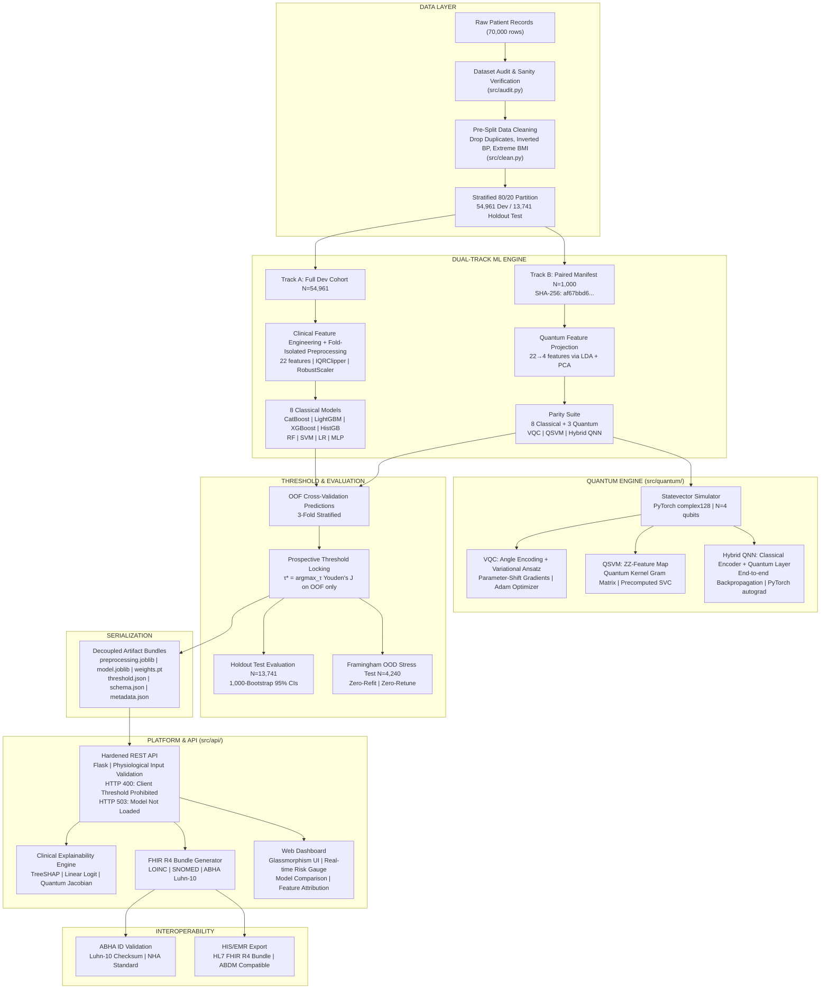
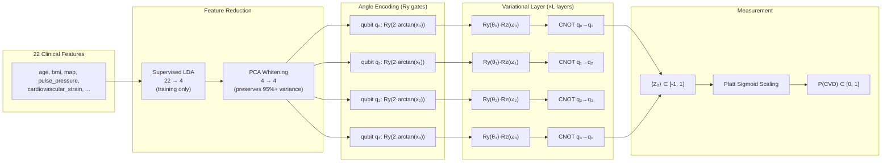
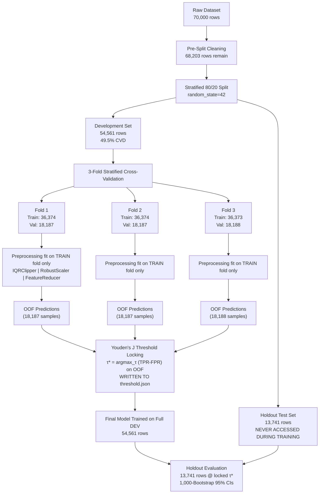
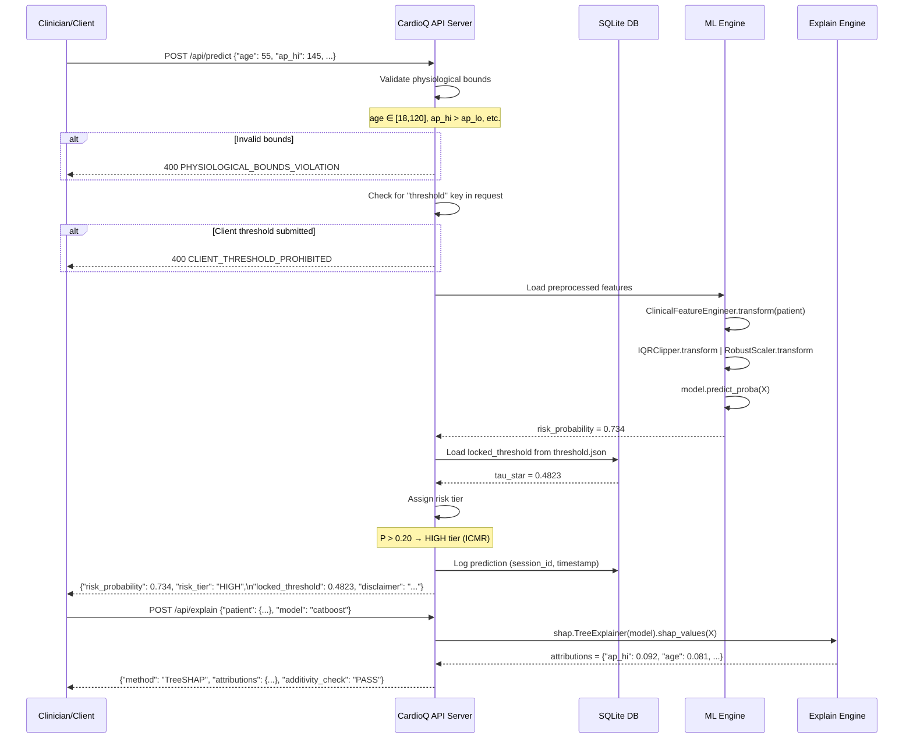
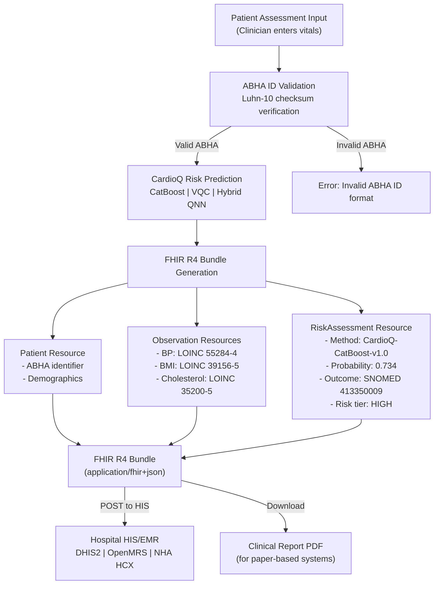
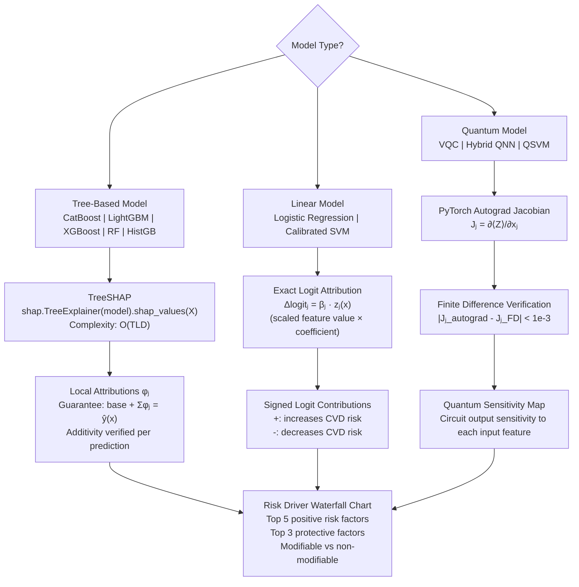

# CardioQ: System Architecture Diagrams
## SIH Problem Statement 3 — Technical Document 06
### Visual Architecture Reference for Judges, Evaluators & Developers

---

## Diagram 1: Complete Platform Architecture (Mermaid)

---

## Diagram 2: Quantum Circuit Architecture

---

## Diagram 3: Data Partition & Leakage Prevention

---

## Diagram 4: API Request Flow

---

## Diagram 5: Hybrid QNN Forward Pass

```mermaid
flowchart LR
    X["Patient Features\n22-dimensional"] --> ENC["Classical Encoder\nLinear(22→4) + Tanh"]
    ENC --> QIN["Quantum Input\n4-dimensional z"]

    subgraph "Quantum Circuit (4 qubits)"
        QIN --> AE["Angle Encoding\nRy(2·arctan(zⱼ)) on each qubit"]
        AE --> VL1["Variational Layer 1\nRy(θ)Rz(ω) + CNOT ring"]
        VL1 --> VL2["Variational Layer 2\nRy(θ)Rz(ω) + CNOT ring"]
        VL2 --> VL3["Variational Layer 3\nRy(θ)Rz(ω) + CNOT ring"]
        VL3 --> MEAS["Measurement\n[⟨Z₀⟩, ⟨Z₁⟩, ⟨Z₂⟩, ⟨Z₃⟩]"]
    end

    MEAS --> DEC["Classical Decoder\nLinear(4→1) + Sigmoid"]
    DEC --> PROB["P(CVD) ∈ [0,1]"]

    PROB --> LOSS["BCE Loss"]
    LOSS --> GRAD["PyTorch autograd\n∂L/∂θ through quantum-classical boundary"]
    GRAD --> ADAM["Adam Optimizer\nUpdate classical weights + circuit parameters"]
```

---

## Diagram 6: ABHA & FHIR Interoperability Flow

---

## Diagram 7: Explainability Architecture

