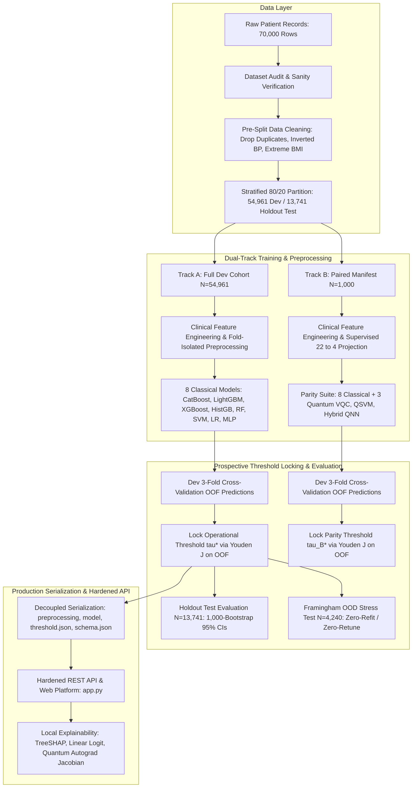

# CardioQ: System Architecture & Design Specification
## Hybrid Quantum-Classical Cardiovascular Disease Prediction Platform
### Scientifically Defensible, Forensic-Remediated Clinical Decision-Support Benchmark

> [!IMPORTANT]
> **Platform Certification**: **Technically stable for internal hackathon demonstration; clinical deployment is not claimed.**

---

## 1. Architectural Overview

CardioQ is an enterprise-grade, leakage-safe clinical machine learning and quantum computing platform engineered for cardiovascular disease (CVD) risk stratification. The platform integrates:
- Rigorous pre-training clinical data auditing, row-independent age conversion, and pre-split data sanitation.
- Strict fold-isolated preprocessing, IQR outlier bounds, and scaling.
- A **Dual-Track Benchmarking Architecture**:
  - **Track A (Clinical Utility Benchmark)**: 8 classical models trained on the full development cohort ($N_{\text{dev}} = 54,961$) and evaluated on the untouched 13,741 holdout test partition with 1,000-iteration bootstrap 95% confidence intervals.
  - **Track B (Algorithmic Parity Benchmark)**: 8 classical and 3 variational quantum models evaluated on an identical deterministic stratified subsample manifest ($N = 1,000$, SHA-256: `af67bbd6...`) under an identical $N=1,000$ training-data budget.
- Supervised linear projection ($22 \to 4$) and PCA reduction to eliminate silent feature slicing in quantum circuits (**VQC**, **QSVM**, **Hybrid QNN**).
- **Prospective Decision Threshold Locking**: Optimal decision thresholds ($\tau^*$) derived strictly from training out-of-fold (OOF) cross-validation Youden's $J$ statistic. Client requests cannot override or alter the locked threshold.
- **Out-of-Distribution (OOD) Transportability Stress Testing**: External evaluation against the **Framingham Heart Study** ($N=4,240$) conducted zero-refit and zero-retune to investigate cross-cohort domain shift and endpoint divergence (prevalent CVD vs 10-year incident CHD).
- **Mathematical Local Explainability**: True local **TreeSHAP** attributions (`shap.TreeExplainer`) for tree ensembles, exact linear logit attributions ($\beta_j z_j$), and exact PyTorch autograd input feature Jacobians ($\partial \langle Z \rangle / \partial x_j$) for quantum circuits verified by finite differences.
- **Decoupled Production Serialization**: Standalone modular artifact bundles (`preprocessing.joblib`, `model.joblib`/`weights.pt`, `threshold.json`, `schema.json`, `circuit_config.json`, `metadata.json`) enabling stateless pipeline reconstruction.
- An interactive clinical decision-support web application and hardened REST API.

---

## 2. Quantum Computing Architecture

### 2.1 Quantum Statevector Simulation Engine (`src/quantum/circuit.py`)
To guarantee reproducible, high-throughput execution without external C++ compilation dependencies, CardioQ utilizes an exact tensor-network statevector simulator implemented in PyTorch and NumPy.
* **State Representation**: An $N$-qubit system is modeled as a complex tensor of shape $(2, 2, \dots, 2)$ ($N$ dimensional indices corresponding to binary basis states $\{0, 1\}^N$).
* **Quantum Gates**:
  - **Single-Qubit Rotations**:
    $$R_x(\theta) = \begin{pmatrix} \cos(\theta/2) & -i\sin(\theta/2) \\ -i\sin(\theta/2) & \cos(\theta/2) \end{pmatrix}$$
    $$R_y(\theta) = \begin{pmatrix} \cos(\theta/2) & -\sin(\theta/2) \\ \sin(\theta/2) & \cos(\theta/2) \end{pmatrix}$$
    $$R_z(\theta) = \begin{pmatrix} e^{-i\theta/2} & 0 \\ 0 & e^{i\theta/2} \end{pmatrix}$$
  - **Entanglement**: Controlled-NOT (CNOT) and Controlled-Z (CZ) gates configured in a circular ring topology ($q_i \to q_{(i+1)\%N}$) to maximize quantum entanglement depth.
* **Measurement**: Pauli-$Z$ observable expectation value for each qubit:
  $$\langle Z_q \rangle = \langle \psi | Z_q | \psi \rangle = P(q=0) - P(q=1) \in [-1.0, 1.0]$$

### 2.2 Variational Quantum Classifier (VQC) (`src/models/vqc_model.py`)
* **Feature Encoding**: Angle encoding mapping continuous clinical attributes $x_j$ to rotation angles $\phi_j = 2\arctan(x_j) \in [-\pi, \pi]$ via single-qubit $R_y(\phi_j)$ gates.
* **Layered Ansatz**: $L$ variational layers where each layer applies parameterized single-qubit rotations $R_y(\theta_{l, q}) R_z(\omega_{l, q})$ followed by an entangling CNOT ring.
* **Parameter Optimization**:
  - Analytical **Parameter-Shift Rule** for exact hardware-compatible gradient computation:
    $$\frac{\partial \langle Z \rangle}{\partial \theta_k} = \frac{\langle Z(\theta_k + \frac{\pi}{2}) \rangle - \langle Z(\theta_k - \frac{\pi}{2}) \rangle}{2}$$
  - Mini-batch Adam optimization minimizing Binary Cross-Entropy loss.
  - Platt sigmoid scaling for well-calibrated posterior risk probabilities.

### 2.3 Quantum Support Vector Machine (QSVM) (`src/models/qsvm_model.py`)
* **ZZ-Feature Map**: Maps input vectors into $2^N$-dimensional Hilbert space using non-linear two-qubit entanglement:
  $$U_{\Phi(x)} = \exp\left(i \sum_j x_j Z_j + \sum_{j < k} (\pi - x_j)(\pi - x_k) Z_j Z_k\right) H^{\otimes N}$$
* **Quantum Kernel Gram Matrix**:
  $$K(x_i, x_j) = |\langle \Phi(x_i) | \Phi(x_j) \rangle|^2$$
  Satisfies Mercer's condition ($K \ge 0, K(x, x) = 1$).
* **Classifier**: Dual support vector machine with precomputed quantum kernel and Platt calibrated probabilities.

### 2.4 Hybrid Quantum-Classical Neural Network (QNN) (`src/models/hybrid_qnn.py`)
* **Encoder**: Classical feedforward compression layer ($D_{\text{in}} \to N_{\text{qubits}}$) with Tanh activation.
* **Quantum Layer**: $N$-qubit parameterized circuit producing Pauli-$Z$ expectation vector $[\langle Z_0 \rangle, \dots, \langle Z_{N-1} \rangle]$.
* **Decoder**: Linear classification head ($N_{\text{qubits}} \to 1$) with Sigmoid activation.
* **Training**: End-to-end backpropagation through hybrid quantum-classical boundaries.

---

## 3. Classical Machine Learning Suite

The platform includes 8 classical architectures conforming to the uniform `BaseCardioModel` protocol:
1. **CatBoost**: Employs native ordered target statistics for categorical features (`gender`, `cholesterol`, `gluc`), completely bypassing continuous scaling.
2. **LightGBM**: Fast histogram-binned gradient boosted decision trees.
3. **XGBoost**: Extreme gradient boosting with L1/L2 tree regularization.
4. **HistGradientBoosting**: Scikit-learn histogram-based gradient boosting.
5. **Random Forest**: Gini-impurity bagging ensemble with out-of-bag validation.
6. **Calibrated SVM**: Max-margin linear classifier wrapped with 3-fold Platt sigmoid calibration.
7. **Logistic Regression**: Linear log-odds model providing transparent Odds Ratios ($\text{OR} = e^\beta$).
8. **Multilayer Perceptron (MLP)**: Deep feedforward neural network with ReLU activations and Adam optimization.

---

## 4. Leakage-Safe Data Engineering & Sanitation

1. **Pre-Split Data Cleaning (`src/clean.py`)**:
   - Exact duplicates (excluding `id`) removed prior to partitioning.
   - Non-physiological blood pressure inversions ($ap\_hi \le ap\_lo$) dropped.
   - Extreme non-biological BMI outliers ($< 10$ or $> 70 \text{ kg/m}^2$) removed.
2. **Row-Independent Clinical Feature Normalization (`src/features.py`)**:
   - Vectorized row-independent age standardization: `np.where(age > 120.0, age / 365.25, age)`. Single patient payloads and arbitrary inference batches are processed with identical deterministic behavior without relying on batch statistics.
   - Clinical engineered biomarkers: BMI, Mean Arterial Pressure (MAP), Pulse Pressure, and Age Non-linearities.
3. **Train-Only Parameter Estimation**:
   - `IQRClipper`: Computes $[Q_1 - 1.5\cdot\text{IQR}, Q_3 + 1.5\cdot\text{IQR}]$ strictly on training folds.
   - `RobustScaler` / `StandardScaler`: Fitted exclusively on training data.
   - `FeatureReducer` (ANOVA F-test / PCA): Supervised feature selection computed strictly without test fold labels.
   - Quantum Classical-to-Quantum Projection: Supervised linear projection ($22 \to 4$) and PCA reduction ensuring all 22 clinical variables inform quantum states.
4. **Column Schema & Permutation Invariance (`src/models/base.py`, `src/models/serialization.py`)**:
   - `BaseCardioModel._prepare_input` and `ProductionPipeline.transform_raw_dataframe` enforce strict column validation and alignment against `self.metadata["features"]`, preventing silent feature scrambling under DataFrame re-ordering.

---

## 5. Clinical Decision Support & Prospective Threshold Locking

1. **Prospective Threshold Locking via Out-of-Fold (OOF) Optimization**:
   - Decision thresholds ($\tau^*$) are locked **strictly on development out-of-fold (OOF) cross-validation predictions** using Youden's $J$ statistic:
     $$J = \text{Sensitivity} + \text{Specificity} - 1 = \text{TPR} - \text{FPR}$$
   - Optimal threshold maximizes true positive detection while controlling false positives without peeking into evaluation data.
   - The derived threshold is written to `threshold.json` alongside model weights and cannot be modified at inference time.

2. **Prohibition of Evaluation & External Label Peeking**:
   - In prospective clinical deployment, labels from unseen cohorts or future patients are strictly unavailable. Tuning cohort-specific decision thresholds post-hoc on holdout test or external validation sets constitutes severe target leakage.
   - CardioQ freezes $\tau^*$ during model development and enforces it unconditionally during all subsequent evaluations.

3. **Holdout Test Evaluation ($N=13,741$)**:
   - The 13,741-sample holdout test partition is held out untouched upfront.
   - Models are evaluated at their locked operational threshold $\tau^*$ with 1,000-iteration bootstrap 95% confidence intervals across ROC-AUC, PR-AUC, Accuracy, Sensitivity, Specificity, Brier score, and Expected Calibration Error (ECE).

4. **Out-of-Distribution (OOD) Transportability Stress Test (Framingham $N=4,240$)**:
   - Evaluated zero-refit and zero-retune at the locked threshold $\tau^*$ to audit model transportability under real-world domain shifts.
   - Transparently documents performance degradation attributable to:
     - **Study Endpoint Divergence**: Prevalent CVD (cross-sectional exam diagnosis) vs 10-year incident CHD (prospective event).
     - **Biomarker Resolution**: Coarse ordinal tiers (`cholesterol`: 1, 2, 3) vs continuous serum laboratory values (mg/dL).
     - **Prevalence Shift**: Development cohort CVD prevalence of $\approx 49.5\%$ vs external community cohort prevalence of $\approx 15.0\%$.

---

## 6. Software Platform UI, Serialization & Hardened REST API

### 6.1 Decoupled Production Serialization (`src/models/serialization.py`)
- **Modular Component Storage**: Each production pipeline is decoupled into standalone, reconstructible artifacts:
  - `preprocessing.joblib`: Scikit-learn feature engineering and scaler pipeline.
  - `model.joblib` / `weights.pt`: Model instance or PyTorch state dictionary.
  - `threshold.json`: Locked operational threshold $\tau^*$ and training optimization metadata.
  - `schema.json`: Expected input schema, feature names, types, and bounds.
  - `circuit_config.json`: Quantum circuit layout, qubit counts, and ansatz layers.
  - `metadata.json`: Timestamp, framework versions, training commit hash, and validation metrics.
- **Stateless Pipeline Reconstruction**: `reconstruct_production_pipeline()` reinstantiates pipelines from individual component files without relying on monolithic serialized blobs.

### 6.2 Hardened REST API Server (`src/api/server.py`)
- **Zero-Dependency Architecture**: Implemented on Python standard library `http.server`.
- **Strict Error Handling & Zero Data Fabrication**:
  - If a requested model artifact is missing from disk, the API returns **HTTP 503** (`MODEL_NOT_LOADED`). It **never** trains models on startup or fabricates synthetic data.
  - Any client payload attempting to submit a custom `"threshold"` is rejected with **HTTP 400** (`CLIENT_THRESHOLD_PROHIBITED`). Inference strictly consumes the model's locked threshold.
  - Strict physiological input validation enforces biological boundaries (age 18-120, height 80-250 cm, weight 20-350 kg, systolic BP 50-300 mmHg, diastolic BP 30-200 mmHg, $ap\_hi > ap\_lo$).
- **REST Endpoints**:
  - `GET /health`: Platform health, version, and inventory of loaded production models.
  - `GET /api/models`: Model registry metadata and locked operational thresholds.
  - `POST /api/predict`: Real-time CVD risk probability, calibrated risk tier, and locked-threshold classification.
  - `POST /api/explain`: Mathematical local feature attribution and quantum sensitivity.

### 6.3 Mathematical Local Explainability (`POST /api/explain`)
- **Tree-Based Models (CatBoost, LightGBM, XGBoost, Random Forest, HistGB)**:
  - Genuine local **TreeSHAP** attributions via `shap.TreeExplainer`.
  - Guarantees local accuracy and additivity: $\text{base\_value} + \sum_j \phi_j = \hat{y}(x)$.
- **Linear Models (Logistic Regression, Calibrated SVM)**:
  - Exact signed logit contributions: $\Delta \text{logit}_j = \beta_j \cdot z_j(x)$.
- **Quantum Models (VQC, Hybrid QNN)**:
  - Exact PyTorch autograd input feature Jacobian: $J_j = \frac{\partial \langle Z \rangle}{\partial x_j}$.
  - Computes the sensitivity of circuit expectation values with respect to raw input features, mathematically verified against numerical finite differences.

